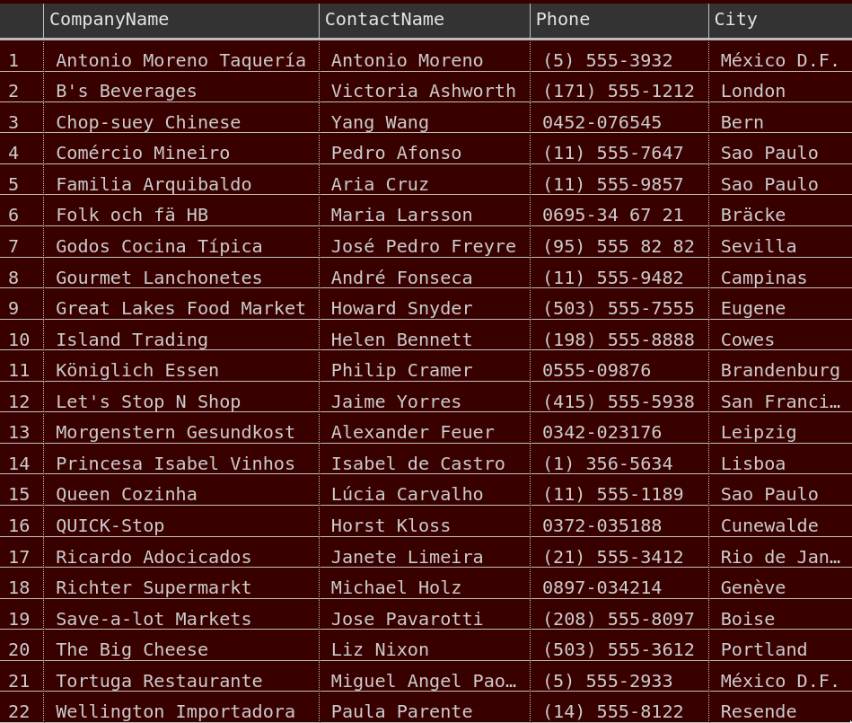
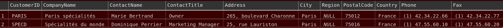
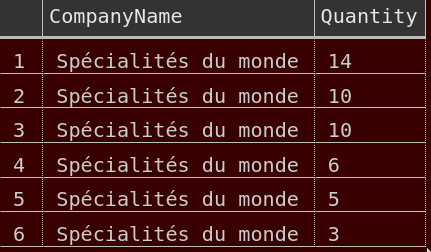

#SQL-Homework

**Q1: How many orders in NWDB (Northwind Database)?**

Query:
```
SELECT COUNT(*) FROM Orders;
```
Answer: 830


**Q2: How many orders have the ShipCity is Rio de Janeiro?**

Query:
```
SELECT COUNT(*) FROM Orders WHERE ShipCity = 'Rio de Janeiro';
```
Answer: 34 (too many to output)

**Q3: Select all orders that the ShipCity is Rio de Janeiro or Reims?**

Query:
```
SELECT COUNT(*) FROM Orders WHERE ShipCity = 'Rio de Janeiro' OR ShipCity = 'Reims';
```

Answer: 39 (too many to output)


**Q4: Select all the entries where the company name that has a z or Z in the table of Customers?**

Query:
```
SELECT COUNT(*) FROM Customers WHERE CompanyName LIKE '%[Zz]%';
```

Answer: 6 (answer without count below)

* Centro comercial Moctezuma
* Lazy K Kountry Store
* Magazzini Alimentari Riuniti
* Queen Cozinha
* Toms Spezialitäten
* Wolski  Zajazd

**Q5: Find all records without fax information, want name, contact numbers and what cities they are in**

Query:
```
SELECT CompanyName, ContactName, City FROM Customers WHERE FAX IS NULL;
```
Answer:




**Q6: Want the information of all clients that are based in Paris**

Query:
```
SELECT * FROM Customers WHERE City = 'Paris';
```

Answer: 2 below (without the headings)



**Q7: Top clients from Paris and top 5 clients in general, from most ordered to least?**
```
-- Need to join Orders, Customers and [Order Details] tables fir CustomerID
-- and OrderID, then search for the city Paris and then order

SELECT Customers.CompanyName, [Order Details].Quantity
FROM ((Orders
INNER JOIN Customers ON Orders.CustomerID = Customers.CustomerID)
INNER JOIN [Order Details] ON Orders.OrderID = [Order Details].OrderID)
WHERE Customers.City = 'Paris'
ORDER BY Quantity DESC;

```

Answers:




